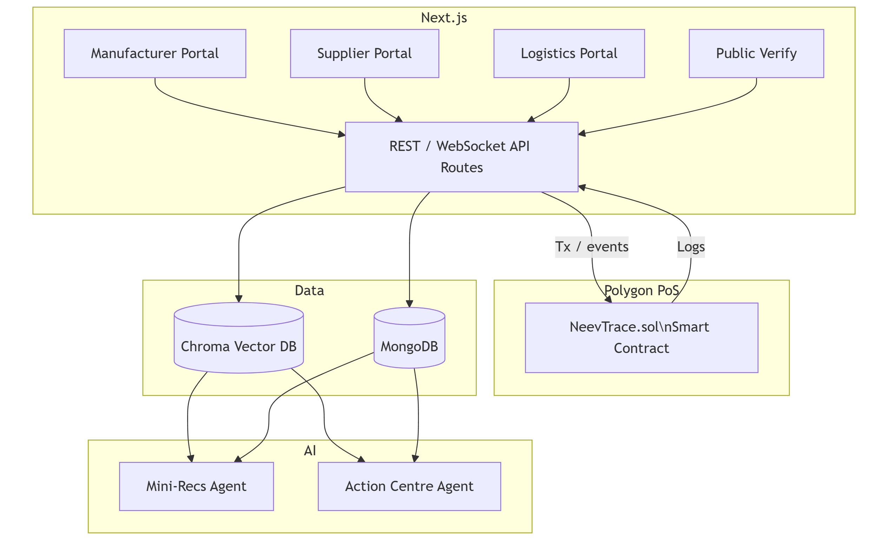

# 🌱 NeevTrace

_Foundation-level transparency & sustainability intelligence for every Indian supply chain._

---

## Table of Contents

1. [Why NeevTrace?](#why-neevtrace)
2. [Feature Matrix](#feature-matrix)
3. [Role-based Portals](#role-based-portals)
4. [Intelligent Layers](#intelligent-layers)
5. [Bidding Marketplace Flow](#bidding-marketplace-flow)
6. [High-Level Architecture](#high-level-architecture)
7. [Tech Stack](#tech-stack)
8. [Getting Started](#getting-started)

---

## Why NeevTrace?

Indian manufacturers struggle with:

| Pain-point                            | Impact                                |
| ------------------------------------- | ------------------------------------- |
| Opaque supplier & logistics data      | Greenwashing risk, lost export orders |
| Manual ESG & BRSR reporting           | 3–6 weeks per cycle                   |
| No price discovery for green partners | Higher scope-3 emissions & costs      |

**NeevTrace** solves this by uniting blockchain immutability, retrieval-augmented AI and a built-in bidding marketplace - turning every batch into a verifiable, low-carbon asset.

---

## Feature Matrix

| Capability                             | Manufacturer | Supplier     | Logistics | Public (QR) |
| -------------------------------------- | ------------ | ------------ | --------- | ----------- |
| Batch creation & QR minting            | ✅           | —            | —         | View-only   |
| Live custody tracking                  | ✅           | ✅ (own leg) | ✅        | View-only   |
| Certificate upload & validity alerts   | ✅           | ✅           | ✅        | —           |
| AI “Mini-Recs” (best supplier / route) | ✅           | —            | ✅        | —           |
| Sustainable-finance “Action Centre”    | ✅           | —            | —         | —           |
| Bidding for PO / route contracts       | Evaluates    | Submit       | Submit    | —           |
| Automated BRSR / CSRD export           | ✅           | —            | —         | —           |

---

## Role-based Portals

### 1. Manufacturer Portal

_Home for planners & sustainability officers_

- Batch dashboard, heat-maps, certificate vault
- AI Mini-Recommendations panel
- Marketplace board showing live supplier & logistics bids
- Action Centre: finance incentives, ESG compliance gaps
- One-click regulatory exports

### 2. Supplier Portal

_Where vendors prove worth_

- Onboard / update certificates (GST, BIS, ISO, MSME)
- See open RFQs, submit bids (price, CO₂e, lead time)
- KPI scorecard + improvement nudges

### 3. Logistics Portal

_For 3PL & fleet operators_

- QR checkpoint scanner (mobile-first PWA)
- Emission auto-calc per leg (fuel, distance)
- Bid on lanes; AI suggests EV or rail shifts

### 4. Public QR Page

- Journey map, carbon breakdown, compliance badges
- “Verify on-chain” button for provenance proof

---

## Intelligent Layers

1. **Blockchain Ledger (Solidity on Polygon)**  
   Immutably stores: `BatchCreated`, `CustodyTransfer`, `CertificateHash`.
2. **RAG Layer (Chroma + OpenAI embeddings)**  
   Pulls relevant certificates, regulations & past bids on demand.
3. **Agentic AI**
   - **Mini-Recs Agent** → chooses optimal supplier or carrier for a new batch
   - **Finance & Compliance Agent** → maps batches to green-loan schemes, flags upcoming BRSR gaps

---

## Bidding Marketplace Flow

1. Manufacturer posts RFQ/route → auto-indexed in Chroma.
2. Suppliers & logistics submit bids (REST / WebSocket).
3. Mini-Recs Agent scores bids on cost × CO₂ × lead-time.
4. Manufacturer accepts → smart contract emits `BidAwarded`.
5. Winning partner is locked to the batch; tracking starts.

---

## High-Level Architecture



---

## Tech Stack

| Layer           | Tech                                               |
| --------------- | -------------------------------------------------- |
| Front-end       | Next.js 15, React 19, Tailwind CSS, Zustand        |
| API / Server    | Next.js API Routes,                                |
| Smart Contracts | Solidity                                           |
| Data            | MongoDB Atlas, Mongoose TS                         |
| Vector Search   | Chroma, `@langchain/community`                     |
| AI              | LangChain JS, Google Gemini 2.5 Pro, Cron jobs (node-cron) |
| Auth            | Civic Auth + Core (wallet)                         |
| DevOps          | pnpm monorepo, Docker, GitHub Actions              |

---

## Getting Started

```bash
# 1. Clone
git clone https://github.com/arpankumarde/neevtrace.git
cd neevtrace

# 2. Install
pnpm install

# 3. Environment
cp .env.example .env.local

# 6. Run app
pnpm dev
```

Visit `http://localhost:3000`.

---

### Made with 💚 in India to build greener supply chains.
